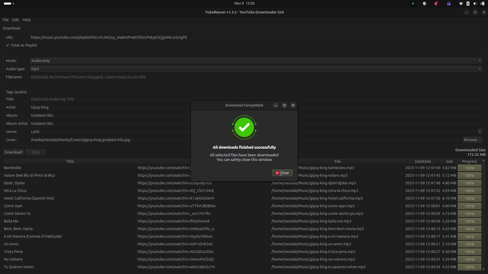
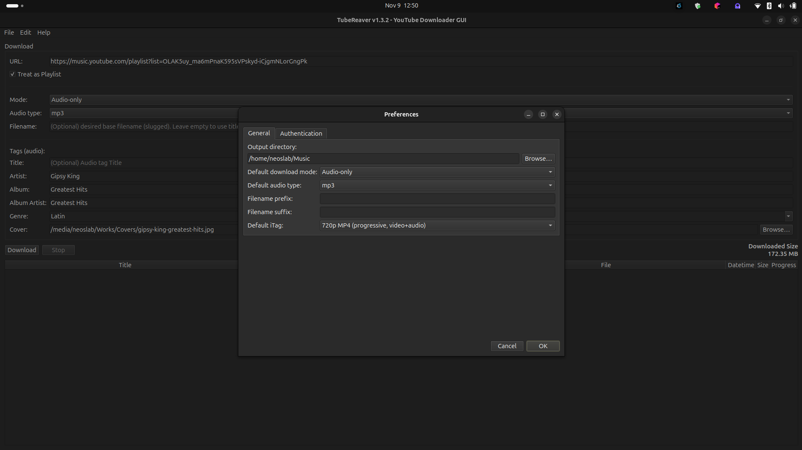
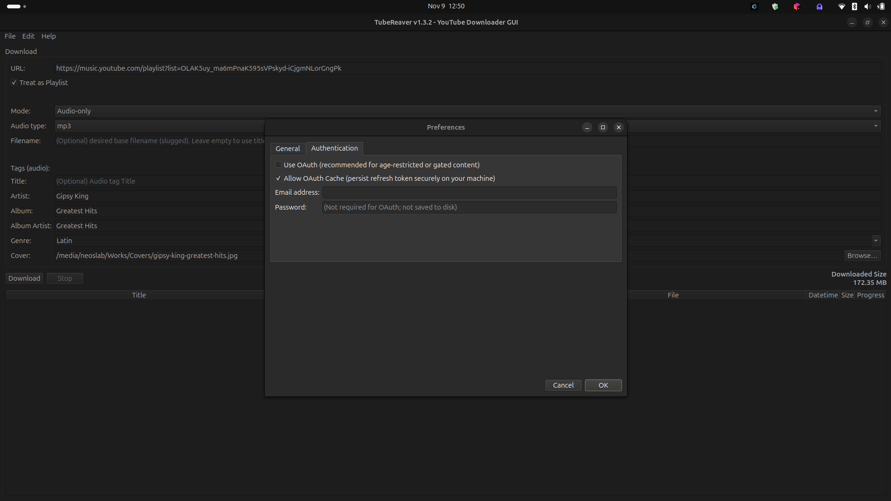
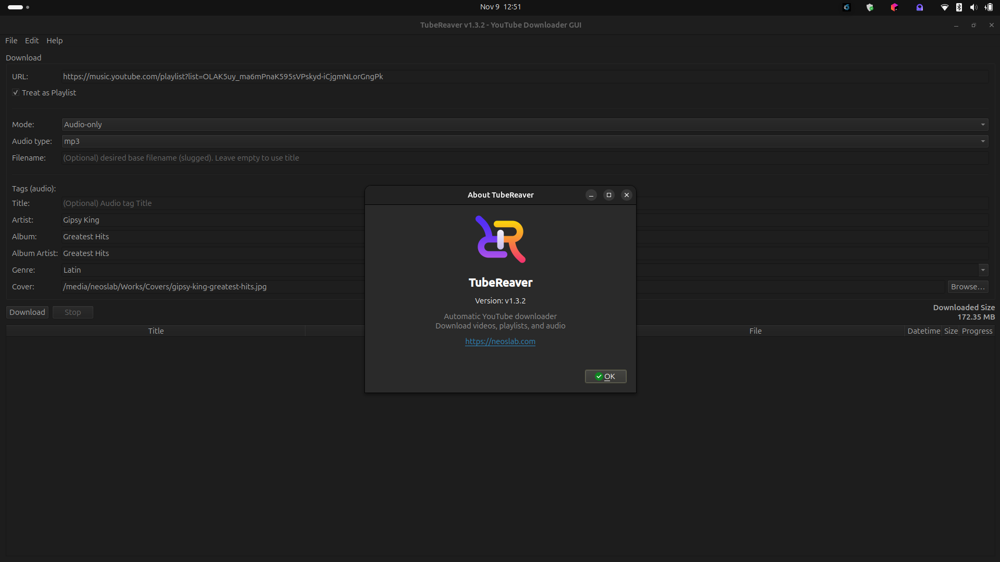
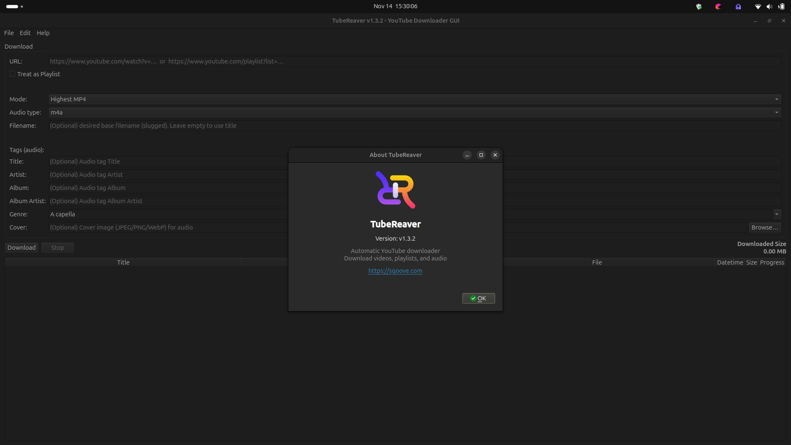

# TubeReaver — YouTube Downloader GUI


**TubeReaver** is a powerful and elegant **GUI-based YouTube downloader** built with **PyQt6** and **pytubefix**.  
It allows downloading **videos, playlists, or audio tracks** with tagging, progress tracking, and full metadata support — all without touching the terminal.

* * *

## Features

- Clean, intuitive **PyQt6 GUI**
- **Single video** or **playlist** downloads
- **Audio-only** or **video** modes
- Support for **itag**, **m4a**, and **mp3**
- **Progress bars** and **live status table**
- Integrated **metadata tagging** (Title, Artist, Album, etc.)
- **Cover image embedding** and **genre selector**
- **OAuth support** for age-restricted videos
- Automatic **prefix/suffix** filename options
- **Preferences dialog** for persistent settings
- **About dialog** with version info
- Cross-platform: Ubuntu, Windows, macOS

* * *

## Screenshots







* * *

## Requirements

- Python **3.9+**
- Packages:

```bash
sudo apt update
sudo apt install -y python3-pyqt6 python3-pyqt6.qt6-tools ffmpeg
````

* `pytubefix` (included in source)
* `ffmpeg` required for audio conversion/tagging

* * *

## Installation

Download the latest DEB version from the [releases](https://github.com/sqoove/tubereaver/releases/) section (the current version is v1.3.2) and use the following command:

```bash
cd /tmp/
wget https://github.com/sqoove/tubereaver/releases/download/v1.3.2/tubereaver_1.3.2_all.deb
sudo dpkg -i tubereaver_1.3.2_all.deb
```

* * *

## Usage

**TubeReaver** provides a simple, tab-free interface where all inputs and tags are accessible at once.

**Basic workflow:**

1. Paste a YouTube video or playlist URL.
2. Choose download **mode** (`Highest MP4`, `Audio-only`, or `itag`).
3. Select **audio format** (`m4a` or `mp3`).
4. Optionally fill in **metadata** and **cover image**.
5. Click **Download** to start — progress will appear in the table.
6. Use **Stop** to interrupt ongoing downloads safely.

The table shows:

| Title       | URL          | Saved File     | Mtime         | Size      | Progress     |
| ----------- | ------------ | -------------- | ------------- | --------- | ------------ |
| Video title | YouTube link | Local filename | Last modified | File size | Progress bar |

* * *

## Preferences

Accessible via **Edit → Preferences**.
All settings are saved to `~/.config/tubereaver/tubereaver.conf`.

**Options include:**

* Output directory
* Default download mode (MP4 / Audio-only / itag)
* Default audio type (`m4a` or `mp3`)
* Filename prefix and suffix
* Default iTag value
* OAuth and cache preferences
* Optional email and runtime password (not stored on disk)

* * *

## Safety and Design

* Uses the modern **pytubefix** backend
* **OAuth** optional for restricted videos
* Downloads happen in a **QThread** to keep UI responsive
* **Stop button** performs graceful interruption (non-blocking)
* **FFmpeg presence check** before conversion
* Errors are displayed in a modal dialog
* All UI and I/O operations are **thread-safe**
* **ConfigManager** ensures safe read/write to config directory

* * *

## Technical Design

Core modules:

* `SysUtils` — file size formatting, ffmpeg check, metadata builder
* `TextUtils` — text and slug handling for clean filenames
* `ConfigManager` — persistent preferences handler
* `DialogPrefs`, `DialogAbout`, `DialogCompleted` — PyQt6 dialogs
* `DownloadWorker` — threaded download engine with signals
* `DownloadTask` — dataclass encapsulating job configuration
* `TubeReaver` — main GUI orchestrator
* `AppEntry` — application bootstrapper and event loop

Signals handled:

* `sigprogress` — updates per-download progress
* `sigstatus` — text status per row
* `signitemstart` — new download entry
* `sigitemdone` — item completion
* `sigitemerror` — error logging
* `sigitemcomplete` — final result summary

* * *

## Development

To modify or extend this script in a Python environment such as PyCharm or any other IDE, make sure to install the required dependencies by running:

```bash
git clone https://github.com/sqoove/tubereaver
cd tubereaver
python -m pip install --upgrade pip
python -m pip install -r requirements.txt
python main.py
```

* * *

## Know bugs

### PyCharm warning

```
Cannot find reference 'connect' in 'pyqtSignal | function'
```

**Fix (stub tweak):** Edit `QtCore.pyi` in your environment’s `site-packages/PyQt6` and add `connect`/`emit` to `pyqtSignal`:

```python
# Support for new-style signals and slots.
class pyqtSignal:

    signatures = ...    # type: tuple[str, ...]

    def __init__(self, *types: typing.Any, name: str = ...) -> None: ...

    @typing.overload
    def __get__(self, instance: None, owner: type['QObject']) -> 'pyqtSignal': ...

    @typing.overload
    def __get__(self, instance: 'QObject', owner: type['QObject']) -> 'pyqtBoundSignal': ...

    # Cannot find reference 'connect' in 'pyqtSignal | function' fix
    def connect(self, slot: 'PYQT_SLOT') -> 'QMetaObject.Connection': ...
    def emit(self, *args: typing.Any) -> None: ...
```

> Note: Editing stubs is brittle. Alternatively, add `# type: ignore[attr-defined]` on lines where `connect`/`emit` are flagged.

### PyQt6 type-stubs error with `QDialogButtonBox`

**Error example:**

```
Unexpected type(s):(Literal[StandardButton.Cancel])
Possible type(s):(Literal[StandardButton.Ok])(Literal[StandardButton.Ok])
```

**Cause:** Some PyQt6 stubs model `setStandardButtons` as a single `StandardButton`, but at runtime it’s a flag enum, so `Ok | Cancel` gets flagged.

```python
from typing import cast
btns = QDialogButtonBox(parent=self)
buttons = cast(
    QDialogButtonBox.StandardButton,
    int(QDialogButtonBox.StandardButton.Ok) | int(QDialogButtonBox.StandardButton.Cancel)
)
btns.setStandardButtons(buttons)
```

* * *

## Reference

- https://github.com/JuanBindez/pytubefix

* * *

## Contributing

Contributions are welcome! Please follow these steps:

1. Fork the repository.
2. Create a new branch (`git checkout -b feature/your-feature`).
3. Make your changes and commit them (`git commit -m "Add your feature"`).
4. Push to your branch (`git push origin feature/your-feature`).
5. Open a pull request with a clear description of your changes.

Ensure your code follows PEP 8 style guidelines and includes appropriate tests.

* * *

## License

This project is licensed under the MIT License. See the [LICENSE](LICENSE) file for details.

* * *

## Contact

For any issues, suggestions, or questions regarding the project, please open a new issue on the official GitHub repository or reach out directly to the maintainer through the [GitHub Issues](issues) page for further assistance and follow-up.